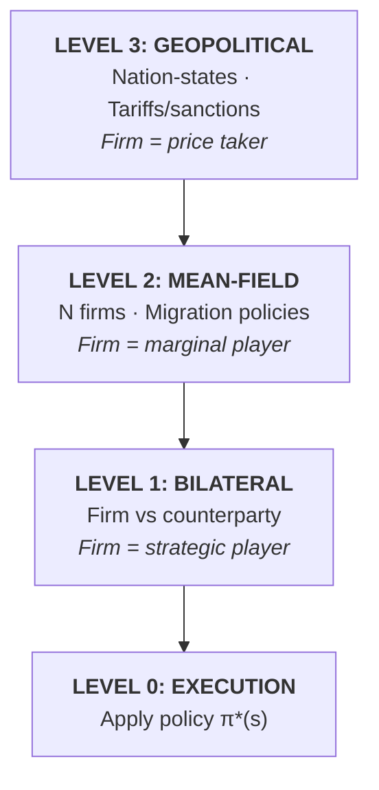
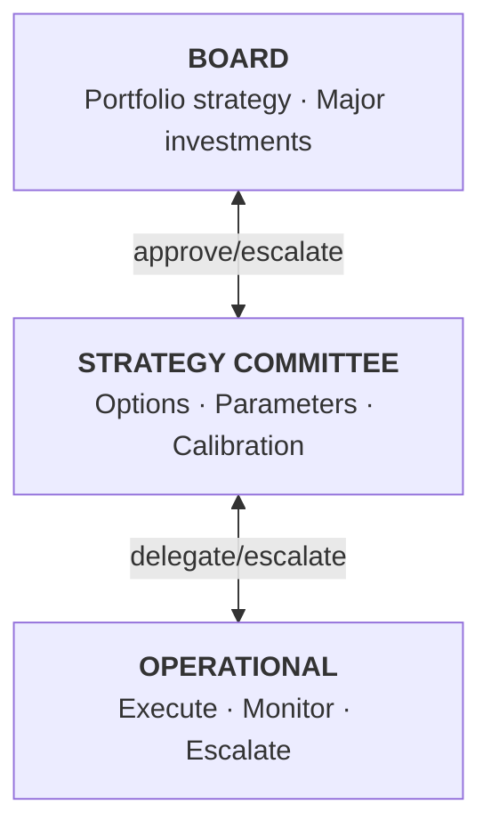
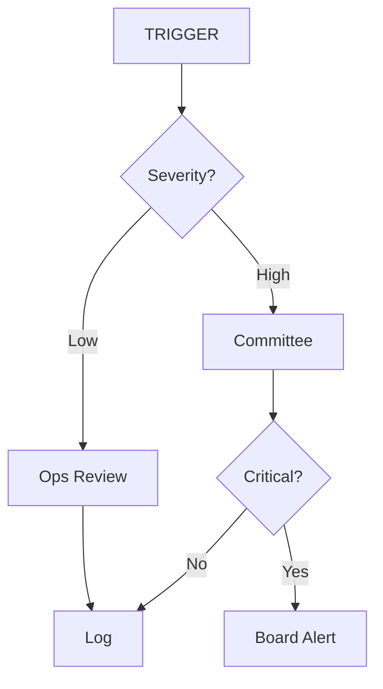

# Unified Bellman-Wasserstein Mean-Field Framework for Strategic Autonomy

## A Quantitative Approach to Strategic Dependency Management Under Uncertainty

---

## Abstract

This document presents a unified mathematical framework for managing strategic dependencies (supplier, regulatory, technological, financial) under deep uncertainty. The framework combines:

1. **Bellman dynamic programming** for sequential decision optimization
2. **Wasserstein distributionally robust optimization (DRO)** for ambiguity aversion
3. **Mean-field game theory** for scalable multi-agent dynamics
4. **Multi-criterion analysis** for action-driven decision support

The result is a **Strategic Autonomy Operating System** that transforms dependency risk from a static cost-benefit analysis into a dynamic, state-contingent policy with explicit triggers, governance hooks, and coalition considerations.

---

## Table of Contents

1. [Motivation: Why This Framework](#1-motivation-why-this-framework)
2. [Mathematical Foundations](#2-mathematical-foundations)
3. [The Hierarchical Game Structure](#3-the-hierarchical-game-structure)
4. [Mean-Field Generalization](#4-mean-field-generalization)
5. [Multi-Criterion Action-Driven Analysis](#5-multi-criterion-action-driven-analysis)
6. [Strategic Monitoring System](#6-strategic-monitoring-system)
7. [Governance Integration](#7-governance-integration)
8. [Computational Methods](#8-computational-methods)
9. [Case Study: Technology Supplier Dependency](#9-case-study-technology-supplier-dependency)
10. [Extensions and Future Work](#10-extensions-and-future-work)
11. [References](#11-references)

---

## 1. Motivation: Why This Framework

### 1.1 The Strategic Dependency Problem

Modern firms face a complex web of dependencies:

| Dependency Type | Example | Risk Vector |
|-----------------|---------|-------------|
| **Supply Chain** | Critical component supplier | Disruption, pricing power |
| **Technology** | Cloud infrastructure, software platforms | Lock-in, kill switch |
| **Regulatory** | Licenses, certifications, compliance | Revocation, cost increase |
| **Financial** | Credit facilities, insurance | Access denial, terms change |
| **Market** | Key customers, distribution channels | Revenue concentration |
| **Governance** | Shareholders, creditors | Control contests, covenants |

Each dependency creates **strategic exposure**: the counterparty can, intentionally or through circumstances, impose costs on the firm.

### 1.2 Limitations of Traditional Approaches

**Traditional Risk Management** asks: "What is the probability of disruption, and what is the expected cost?"

This approach fails when:
- **Probabilities are unknown or contested** (political risk, unprecedented events)
- **Adversaries can adapt** (suppliers observe firm actions and respond)
- **Decisions are sequential** (today's action affects tomorrow's options)
- **Multiple criteria matter** (cost, cash, reputation, strategic position)

### 1.3 The Game-Theoretic Alternative

We reframe dependency management as a **sequential game against Nature**:

- **The Firm** chooses actions (wait, invest, hedge, exit) to minimize worst-case cost
- **Nature** controls the environment (tariffs, regulations, market conditions) and, under ambiguity, can adversarially shift probability distributions

This framing captures:
1. **Strategic optionality**: The firm's decision is a policy (state-contingent rule), not a one-time choice
2. **Ambiguity aversion**: We protect against forecast errors, not just bad draws
3. **Dynamic adaptation**: The policy adapts as the state evolves

### 1.4 From Single Dependency to Portfolio to Industry

The framework scales through three levels:

| Level | Scope | Method | Complexity |
|-------|-------|--------|------------|
| **Single** | One dependency | Exact Bellman-Wasserstein | O(T x |S| x |A|) |
| **Portfolio** | N dependencies (N small) | Joint state space | O(T x |S|^N x |A|^N) |
| **Mean-Field** | Industry (N large) | Distribution over states | O(T x |S| x |A| x iterations) |

---

## 2. Mathematical Foundations

### 2.1 State Space

The state $s$ captures all information relevant to the decision:

**For a single dependency:**
$$s = (\tau, m, \mathbf{f}) \in \mathcal{S}$$

Where:
- $\tau \in \{0, 1, ..., K\}$: External regime (e.g., tariff level)
- $m \in \{0, 1, ..., M\}$: Migration progress (years completed)
- $\mathbf{f} = (i, h, e)$: Binary flags (investment started, hedge active, exit exercised)

**For a portfolio of N dependencies:**
$$\mathbf{s} = (s_1, ..., s_N) \in \mathcal{S}^N$$

**For mean-field:**
$$\mu \in \mathcal{P}(\mathcal{S}): \text{Distribution of states across population}$$

### 2.2 Action Space

The firm chooses from a discrete set of actions:

$$\mathcal{A} = \{\text{wait}, \text{invest}, \text{hedge}, \text{accelerate}, \text{exit}\}$$

| Action | Effect | Cost Type |
|--------|--------|-----------|
| **Wait** | No progress | Zero immediate |
| **Invest** | Start/continue migration | CAPEX + OPEX |
| **Hedge** | Reduce exposure without exit | CAPEX (setup) + reduced tariff |
| **Accelerate** | Fast-track migration | Higher OPEX |
| **Exit** | Complete substitution | Termination fees |

### 2.3 Transition Dynamics

**Nominal transition kernel** $p_0(s' | s, a)$:

The state evolves according to:
1. **External regime**: Markov chain with parameters $(p_{01}, p_{10})$
2. **Migration progress**: Deterministic given action
3. **Flags**: Updated based on actions taken

$$p_0(s' | s, a) = P(\tau' | \tau) \cdot \mathbf{1}[m' = f_m(m, a)] \cdot \mathbf{1}[\mathbf{f}' = f_{\mathbf{f}}(\mathbf{f}, a, m')]$$

### 2.4 Loss Function

The stage loss $\ell(s, a)$ represents cost incurred at each period:

$$\ell(s, a) = \ell_{\text{CAPEX}}(s, a) + \ell_{\text{OPEX}}(s, a) + \ell_{\text{tariff}}(s, a) + \ell_{\text{exit}}(s, a)$$

Each component depends on current state and action:
- $\ell_{\text{CAPEX}}$: One-time investment costs
- $\ell_{\text{OPEX}}$: Recurring operational costs
- $\ell_{\text{tariff}}$: Exposure to external regime
- $\ell_{\text{exit}}$: Termination and switching costs

### 2.5 Wasserstein Ambiguity Set

We do not trust the nominal transition $p_0$ exactly. Nature can choose any distribution within a **Wasserstein ball**:

$$\mathcal{P}_\varepsilon(p_0) = \{p \in \mathcal{P}(\mathcal{S}) : W_C(p, p_0) \leq \varepsilon\}$$

Where $W_C$ is the Wasserstein distance with transport cost $C$:

$$W_C(p, q) = \min_{\pi \in \Pi(p,q)} \sum_{i,j} \pi_{ij} C_{ij}$$

The transport cost matrix $C$ encodes which distribution shifts are "easy" for Nature:
- **Cheap**: Moving probability across tariff regimes (political uncertainty)
- **Expensive**: Moving probability across migration progress (firm controls)

### 2.6 Risk Measure: CVaR

We use Conditional Value-at-Risk (CVaR) at level $\alpha$ to focus on tail outcomes:

$$\text{CVaR}_\alpha(L) = \frac{1}{1-\alpha} \int_\alpha^1 \text{VaR}_u(L) \, du$$

For discrete distributions, this is the average of the worst $(1-\alpha)$ fraction of outcomes.

**Interpretation**: CVaR at $\alpha = 0.90$ means "average of the worst 10% of scenarios."

### 2.7 The Bellman-Wasserstein Equation

Combining all elements, the **distributionally robust dynamic program** is:

$$\boxed{V_t(s) = \min_{a \in \mathcal{A}} \sup_{p \in \mathcal{P}_{\varepsilon(t)}(p_0)} \text{CVaR}_\alpha^p\left[\gamma_t \ell(s,a) + V_{t+1}(S')\right]}$$

Where:
- $V_t(s)$: Worst-case cost-to-go from state $s$ at time $t$
- $\gamma_t = (1+r)^{-t}$: Discount factor (WACC)
- $\varepsilon(t)$: Time-varying ambiguity radius (linked to observable uncertainty)

**Terminal condition**: $V_T(s) = 0$ (or terminal cost function)

**Solution method**: Backward induction from $t = T-1$ to $t = 0$

---

## 3. The Hierarchical Game Structure

### 3.1 Overview

Strategic dependencies exist within a hierarchy of games:



### 3.2 Level 3: Geopolitical Regime

The geopolitical state $s_{\text{geo}}$ evolves exogenously according to a Markov chain:

$$P(s'_{\text{geo}} | s_{\text{geo}}) = P_{\text{geo}}$$

**States**: $\{\text{peace}, \text{tension}, \text{conflict}, \text{war}\}$

**Firm's model**: The firm observes $s_{\text{geo}}$ and uses it to:
1. Update transition probabilities $p_{01}, p_{10}$
2. Adjust ambiguity radius $\varepsilon(t, s_{\text{geo}})$

The firm cannot influence Level 3 dynamics directly.

### 3.3 Level 2: Industry Mean-Field

When many firms face the same dependency problem, their collective actions affect:
- **Alternative supplier capacity**: As more firms migrate, capacity tightens
- **Signal strength**: Industry-wide migration sends stronger signal to adversary
- **Coalition opportunities**: Coordination becomes possible

This creates **mean-field coupling**: Individual firm costs depend on aggregate industry state $\mu$.

### 3.4 Level 1: Bilateral Game

For specific high-value counterparties (e.g., key supplier, major regulator), model explicitly as a two-player game:

**Stackelberg structure**:
1. Firm announces/commits to policy $\pi$
2. Counterparty best-responds with $\pi_{\text{cp}}(\pi)$
3. Outcomes determined by joint actions

**Nash structure** (if no commitment):
1. Both players choose simultaneously
2. Equilibrium: Neither can improve unilaterally

### 3.5 Level 0: Execution

Given the solved policy $\pi^\ast$ from upper levels:

$$a_t = \pi^\ast(s_t)$$

This is deterministic application of the optimal policy.

---

## 4. Mean-Field Generalization

### 4.1 Motivation

When the number of firms $N$ is large, explicit multi-player game becomes intractable. Mean-field game theory provides a tractable approximation.

**Key insight**: Replace interaction with specific firms by interaction with the **population distribution**.

### 4.2 Mean-Field State

Instead of tracking each firm's state, track the distribution:

$$\mu_t \in \mathcal{P}(\mathcal{S})$$

Where $\mu_t(s)$ is the fraction of firms in state $s$ at time $t$.

**Aggregate statistics derived from $\mu$**:
- Migration progress distribution: $\mu_{\text{migration}}$
- Capacity utilization: $\text{Cap}(\mu)$
- Coalition strength: $\text{Coal}(\mu)$

### 4.3 Industry Coupling

Individual firm costs depend on $\mu$ through:

**Capacity tightening**:
$$\ell_{\text{CAPEX}}(s, a; \mu) = \ell_{\text{CAPEX}}^0(s, a) \cdot (1 + \kappa \cdot \bar{m}(\mu))$$

Where $\bar{m}(\mu) = \sum_s \mu(s) \cdot m(s)$ is average migration progress.

**Signal amplification**:
$$\varepsilon(t; \mu) = \varepsilon_0(t) \cdot (1 - \delta \cdot \bar{m}(\mu))$$

Higher industry migration reduces ambiguity (clearer market signal to adversary).

### 4.4 Individual Firm's Problem

Given mean-field $\mu$, each firm solves:

$$V_t(s; \mu) = \min_{a \in \mathcal{A}} \sup_{p \in \mathcal{P}_{\varepsilon(t,\mu)}(p_0)} \text{CVaR}_\alpha^p\left[\gamma_t \ell(s,a;\mu) + V_{t+1}(S'; \mu')\right]$$

This yields optimal policy $\pi^\ast(\cdot; \mu)$.

### 4.5 Population Dynamics

Given policy $\pi$, the population evolves according to the **forward Kolmogorov equation**:

$$\mu_{t+1}(s') = \sum_{s \in \mathcal{S}} \mu_t(s) \cdot p_0(s' | s, \pi(s; \mu_t))$$

This is deterministic evolution of the distribution.

### 4.6 Mean-Field Equilibrium (MFE)

**Definition**: A mean-field equilibrium is a pair $(\pi^\ast, \mu^\ast)$ such that:

1. **Optimality**: $\pi^\ast$ solves the individual firm's problem given $\mu^\ast$
2. **Consistency**: $\mu^\ast$ is the distribution induced by all firms following $\pi^\ast$

**Fixed-point characterization**:
$$\mu^\ast = \Phi(\pi^\ast(\cdot; \mu^\ast))$$

Where $\Phi$ is the forward operator.

### 4.7 Computation Algorithm

```
ALGORITHM: Mean-Field Equilibrium via Fixed-Point Iteration
━━━━━━━━━━━━━━━━━━━━━━━━━━━━━━━━━━━━━━━━━━━━━━━━━━━━━━━━━━━

Input: 
  - Initial distribution μ⁰
  - Convergence tolerance ε
  - Maximum iterations K

Output:
  - Equilibrium policy π*
  - Equilibrium distribution μ*

1. Initialize: μ ← μ⁰, k ← 0

2. REPEAT:
   
   a. BACKWARD PASS (Bellman with fixed μ):
      For t = T-1, T-2, ..., 0:
        For each s ∈ S:
          V_t(s; μ) ← min_a sup_p CVaR_α^p[γ_t ℓ(s,a;μ) + V_{t+1}(S'; μ)]
          π_t(s; μ) ← argmin_a ...
   
   b. FORWARD PASS (Kolmogorov with fixed π):
      μ'_0 ← μ⁰  (initial distribution)
      For t = 0, 1, ..., T-1:
        For each s' ∈ S:
          μ'_{t+1}(s') ← Σ_s μ'_t(s) · p_0(s' | s, π_t(s; μ))
   
   c. UPDATE:
      Δ ← ||μ' - μ||_∞
      μ ← μ'
      k ← k + 1

3. UNTIL Δ < ε OR k > K

4. RETURN (π, μ)
```

### 4.8 Convergence Properties

**Sufficient conditions for convergence**:
- Contraction: Coupling functions are Lipschitz continuous
- Monotonicity: Higher $\mu$ leads to higher costs (capacity tightening)

**Typical convergence**: 20-50 iterations for well-behaved problems.

### 4.9 Interpretation

The MFE captures:
- **Industry dynamics**: How collective behavior evolves
- **Equilibrium crowding**: Migration becomes more expensive as more firms migrate
- **Signal coordination**: Implicit coordination through observable aggregate behavior

---

## 5. Multi-Criterion Action-Driven Analysis

### 5.1 Motivation

Traditional multi-criteria analysis produces a **ranking** of options. Decision-makers need **actions** with clear **outcome predictions**.

### 5.2 Criterion-Specific Value Functions

For each criterion $c \in \mathcal{C}$, define a loss function $\ell_c(s, a)$ and solve separately:

$$V_t^{(c)}(s) = \min_{a \in \mathcal{A}} \sup_{p \in \mathcal{P}_{\varepsilon(t)}(p_0)} \text{CVaR}_\alpha^p\left[\gamma_t \ell_c(s,a) + V_{t+1}^{(c)}(S')\right]$$

**Standard criteria**:

| Criterion | Loss Function | Units | Interpretation |
|-----------|---------------|-------|----------------|
| **Financial** | Total discounted cost | EUR NPV | Bottom-line impact |
| **EBITDA** | Recurring operational cost | EUR/year | P&L impact |
| **Cash** | Immediate liquidity impact | EUR | Treasury impact |
| **Strategic** | Bargaining position score | Index [0,1] | Negotiation leverage |
| **Execution** | Organizational bandwidth | FTE-months | Change capacity |
| **Optionality** | Future flexibility value | EUR | Real option value |

### 5.3 Action-Outcome Matrix

For a given state $s$ at time $t$, construct:

| Action | Financial | EBITDA | Cash | Strategic | Execution | Optionality |
|--------|-----------|--------|------|-----------|-----------|-------------|
| WAIT | $V^{(fin)}(s,\text{wait})$ | ... | ... | ... | ... | ... |
| INVEST | $V^{(fin)}(s,\text{invest})$ | ... | ... | ... | ... | ... |
| HEDGE | ... | ... | ... | ... | ... | ... |
| ACCELERATE | ... | ... | ... | ... | ... | ... |
| EXIT | ... | ... | ... | ... | ... | ... |

Each cell contains the **worst-case CVaR cost** for that action-criterion pair.

### 5.4 Pareto Frontier

**Definition**: Action $a$ is **Pareto-dominated** if there exists $a'$ such that:
- $V^{(c)}(s, a') \leq V^{(c)}(s, a)$ for all criteria $c$
- $V^{(c)}(s, a') < V^{(c)}(s, a)$ for at least one criterion

**Pareto frontier**: Set of non-dominated actions.

**Decision support**: Only present Pareto-optimal actions to decision-maker.

### 5.5 Switching Conditions

For each non-recommended action $a' \neq a^\ast$, compute:

$$\Delta_{\theta}(a^\ast \to a') = \lbrace\theta : a' \text{ becomes optimal under parameter } \theta\rbrace$$

**Output format**:
- "Switch to HEDGE if $\varepsilon > 0.25$ or $p_{01} > 0.25$"
- "Switch to ACCELERATE if tariff persists > 2 periods"

### 5.6 Confidence Assessment

Confidence in recommendation based on:
1. **Dominance**: How many criteria favor recommended action?
2. **Margin**: How far from switching thresholds?
3. **Sensitivity**: How stable under parameter perturbation?

$$\mathrm{Confidence} = f(\mathrm{dominance}, \mathrm{margin}, \mathrm{sensitivity})$$

---

## 6. Strategic Monitoring System

### 6.1 Architecture


### 6.2 Observable Indicators

**Level 3 (Geopolitical)**:
| Indicator | Source | Frequency | Parameter Mapping |
|-----------|--------|-----------|-------------------|
| EPU Index | Baker-Bloom-Davis | Daily | $\varepsilon_{\text{geo}}(t)$ |
| VIX | CBOE | Real-time | $\varepsilon_{\text{mkt}}(t)$ |
| Sanctions | OFAC, EU | Weekly | $s_{\text{sanction}}$ |
| Trade Actions | USTR | Event | $p_{01}$ adjustment |

**Level 2 (Industry)**:
| Indicator | Source | Frequency | Parameter Mapping |
|-----------|--------|-----------|-------------------|
| Peer Migrations | Press, filings | Event | $\mu_{\text{migration}}$ |
| Capacity Utilization | Market intel | Quarterly | $\text{Cap}(\mu)$ |
| Coalition News | Industry assoc. | Event | $\text{Coal}(\mu)$ |

**Level 1 (Bilateral)**:
| Indicator | Source | Frequency | Parameter Mapping |
|-----------|--------|-----------|-------------------|
| Counterparty Behavior | Contract perf | Continuous | Regime inference |
| Price Movements | Invoices | Monthly | Cost parameters |
| Service Level | Operations | Continuous | Quality state |

### 6.3 Parameter Mapping Functions

**Ambiguity radius from EPU**:
$$\varepsilon(t) = \varepsilon_{\min} + (\varepsilon_{\max} - \varepsilon_{\min}) \cdot \frac{\max(0, \text{EPU}_t - \text{EPU}_{\text{baseline}})}{\text{EPU}_{\text{range}}}$$

**Transition probability adjustment**:
$$p_{01}(t) = p_{01}^{\text{base}} \cdot \left(1 + \beta_{\text{USTR}} \cdot \mathbf{1}[\text{USTR action}]\right) \cdot \left(1 + \beta_{\text{contract}} \cdot \mathbf{1}[\text{renewal} < 12\text{mo}]\right)$$

### 6.4 Trigger Thresholds

**Parameter change triggers** (recompute model):
- $|\Delta\varepsilon| > 0.05$
- $|\Delta p_{01}| > 0.03$
- $|\Delta\mu| > 0.10$

**Model output triggers** (governance escalation):
- $\Delta V_0 > 15\%$ deterioration → Strategy Committee
- $\Delta V_0 > 35\%$ deterioration → Board
- Policy change ($a^\ast$ different) → Strategy Committee

### 6.5 Update Cadence

| Update Type | Frequency | Trigger |
|-------------|-----------|---------|
| Indicator fetch | Daily | Automated |
| Parameter update | Daily | Indicator change |
| Model recompute | On trigger | Parameter threshold |
| Full recalibration | Quarterly | Calendar |
| Governance review | Quarterly + trigger | Calendar + threshold |

### 6.6 Dashboard Specification

**Real-time display**:
```
┌────────────────────────────────────────────────────────────────┐
│ STRATEGIC MONITORING DASHBOARD                    [2026-02-05] │
├────────────────────────────────────────────────────────────────┤
│                                                                 │
│ INDICATORS              │ MODEL STATE                          │
│ EPU: 142.3 [▲]         │ ε(t): 0.156 [▲]                      │
│ VIX: 18.2  [─]         │ p01:  0.150 [─]                      │
│ μ:   0.30  [▲]         │ V0:  -49.2  [▼]                      │
│                         │ π*:  WAIT   [─]                      │
│                                                                 │
│ TRIGGER STATUS                                                 │
│ [●] Recompute: TRIGGERED (μ +0.05)                            │
│ [○] Escalate:  NOT TRIGGERED                                  │
│                                                                 │
│ RECOMMENDED ACTION: WAIT                                       │
│ Switch conditions:                                             │
│   → HEDGE if ε > 0.25                                         │
│   → INVEST if μ > 0.50                                        │
│                                                                 │
└────────────────────────────────────────────────────────────────┘
```

---

## 7. Governance Integration

### 7.1 Decision Rights Architecture



### 7.2 RACI Matrix

| Decision | Board | Committee | Operations | Model |
|----------|-------|-----------|------------|-------|
| Define critical dependencies | A | R | C | I |
| Approve option budget | A | R | C | I |
| Execute WAIT/MONITOR | I | I | A/R | - |
| Execute HEDGE/SIGNAL | I | A | R | C |
| Execute INVEST/EXIT | A | R | C | C |
| Update model parameters | I | A | C | R |

### 7.3 Escalation Protocol



### 7.4 Audit Trail Requirements

Every model run logs:
- Timestamp
- Input parameters (ε, p01, p10, costs)
- Observable indicators triggering run
- Output (V0, π*, action-outcome matrix)
- Any escalations generated
- Decision taken (if any)

---

## 8. Computational Methods

### 8.1 Single-Dependency Solver

**Exact backward induction**:

```python
def bellman_wasserstein_solve(spec, C, eps_fn):
    V = np.zeros((T+1, N_STATES))
    pi = np.zeros((T, N_STATES), dtype=int)
    
    for t in reversed(range(T)):
        eps_t = eps_fn(t, T)
        for s in range(N_STATES):
            values = []
            for a in range(N_ACTIONS):
                p0 = transition_kernel(spec, s, a)
                losses = discount(t) * stage_loss(spec, t, s, a) + V[t+1, :]
                
                if eps_t > 0:
                    val = robust_cvar_wasserstein(p0, losses, eps_t, alpha, C)
                else:
                    val = cvar_discrete(p0, losses, alpha)
                
                values.append(val)
            
            pi[t, s] = np.argmin(values)
            V[t, s] = values[pi[t, s]]
    
    return V, pi
```

**Complexity**: $O(T \times |S| \times |A| \times n_{\text{LP}})$

Where $n_{\text{LP}}$ is the time to solve the Wasserstein DRO LP (~10-50ms).

### 8.2 Wasserstein DRO Inner Problem

The robust CVaR under Wasserstein ambiguity is solved via LP duality:

$$\sup_{p : W_C(p, p_0) \leq \varepsilon} \text{CVaR}_\alpha^p(L) = \min_{\eta, \lambda \geq 0, u} \bigl\lbrace \eta + \lambda\varepsilon + p_0^\top u \bigr\rbrace$$

Subject to:
$$u_i + \lambda C_{ij} \geq \frac{1}{1-\alpha}(L_j - \eta)^+ \quad \forall i, j$$

Solved using CVXPY with CLARABEL or SCS solvers.

### 8.3 Portfolio Solver

**For N ≤ 3** (joint state space tractable):
- Enumerate all joint states
- Apply single-dependency solver to joint space
- Complexity: $O(T \times |S|^N \times |A|^N)$

**For N > 3** (approximation required):

*Decomposition approach*:
1. Solve each dependency independently
2. Coordinate via Lagrangian relaxation of constraints
3. Iterate to feasibility

*Sampling approach*:
1. Sample representative joint states
2. Solve on samples
3. Interpolate for remaining states

### 8.4 Mean-Field Solver

```python
def mean_field_equilibrium(spec, coupling, mu_init, tol=1e-4, max_iter=100):
    mu = mu_init.copy()
    
    for k in range(max_iter):
        # Backward pass: Bellman given μ
        V, pi = bellman_with_coupling(spec, mu, coupling)
        
        # Forward pass: Kolmogorov given π
        mu_new = forward_kolmogorov(mu_init, pi, spec.horizon)
        
        # Check convergence
        delta = np.max(np.abs(mu_new - mu))
        if delta < tol:
            break
        
        mu = mu_new
    
    return pi, mu
```

**Complexity**: $O(\text{iterations} \times T \times |S| \times |A| \times n_{\text{LP}})$

Typically 20-50 iterations.

### 8.5 Computational Performance

| Problem Size | States | Time (exact) | Time (approx) |
|--------------|--------|--------------|---------------|
| Single dependency | 64 | 30-60s | - |
| 2 dependencies | 4,096 | 30-60min | - |
| 3 dependencies | 262,144 | Intractable | 5-10min |
| Mean-field (N=100) | 64 + distribution | - | 10-30min |

---

## 9. Case Study: Technology Supplier Dependency

### 9.1 Scenario Description

**Firm**: European industrial company
**Dependency**: US cloud infrastructure provider (AWS/Azure/GCP)
**Risk**: Regulatory divergence, data sovereignty requirements, potential sanctions

### 9.2 State Space Specification

| Variable | Values | Interpretation |
|----------|--------|----------------|
| $\tau$ | {0, 1, 2} | Regulatory regime: normal, restricted, blocked |
| $m$ | {0, 1, 2, 3} | Migration to EU cloud: years completed |
| $i$ | {0, 1} | Investment program started |
| $h$ | {0, 1} | Hybrid architecture deployed |
| $e$ | {0, 1} | Full EU sovereignty achieved |

Total states: $3 \times 4 \times 2 \times 2 \times 2 = 96$

### 9.3 Cost Parameters (Calibrated)

| Parameter | Value | Basis |
|-----------|-------|-------|
| Annual cloud spend | €15M | Actual |
| Restricted regime cost | +40% | Compliance overhead |
| Blocked regime cost | €25M | Emergency migration |
| Migration CAPEX | €8M | Vendor quotes |
| Hybrid CAPEX | €3M | Architecture estimate |
| Migration OPEX | €2M/year | Dual-run costs |
| Full exit cost | €12M | Contract + cutover |

### 9.4 Transition Parameters

| Parameter | Value | Source |
|-----------|-------|--------|
| $p_{01}$ (normal → restricted) | 0.15 | Historical + expert |
| $p_{12}$ (restricted → blocked) | 0.10 | Scenario analysis |
| $p_{10}$ (restricted → normal) | 0.20 | Political cycle |
| $p_{21}$ (blocked → restricted) | 0.05 | Rare recovery |

### 9.5 Ambiguity Calibration

Link $\varepsilon(t)$ to EU-US policy uncertainty:

$$\varepsilon(t) = 0.05 + 0.25 \times \frac{\text{EPU}_{\text{EU-US}}(t) - 100}{200}$$

Range: $[0.05, 0.30]$

### 9.6 Results

**Optimal policy** (current state: normal, no migration, no investment):

| Regime | Migration | Optimal Action | Rationale |
|--------|-----------|----------------|-----------|
| Normal | 0 | WAIT | Option value exceeds cost |
| Normal | 1-2 | CONTINUE | Already invested |
| Restricted | 0 | INVEST + HYBRID | Reduce exposure |
| Restricted | 1-2 | ACCELERATE | Finish faster |
| Blocked | any | EMERGENCY EXIT | No choice |

**Value function**: $V_0 = -€47.2M$ (worst-case CVaR 90%)

**Sovereignty premium**: €4.8M (cost of ambiguity vs. known risk)

### 9.7 Monitoring Triggers

| Trigger | Threshold | Current | Action |
|---------|-----------|---------|--------|
| EPU spike | > 180 | 142 | Monitor |
| Regulatory announcement | Any | None | Escalate |
| Peer migration | > 3 announcements/quarter | 2 | Monitor |
| Contract renewal | < 12 months | 14 | Prepare |

---

## 10. Extensions and Future Work

### 10.1 Continuous State Dynamics

Replace discrete tariff regime with continuous process:

$$d\tau_t = \kappa(\bar{\tau} - \tau_t)dt + \sigma dW_t + J dN_t$$

Requires numerical PDE methods or simulation-based approaches.

### 10.2 Learning and Adaptation

Bayesian update of transition probabilities:

$$p_{01}^{(k+1)} = \frac{\alpha_0 + n_{01}}{\alpha_0 + \beta_0 + n_0}$$

Where $n_{01}$ = observed transitions from 0 to 1, $n_0$ = total observations in state 0.

### 10.3 Partial Observability

POMDP formulation when state is not fully observable:

$$b_{t+1}(s') \propto O(o_{t+1} | s', a_t) \sum_s P(s' | s, a_t) b_t(s)$$

Where $b_t$ is belief distribution over states.

### 10.4 Continuous-Time Formulation

Hamilton-Jacobi-Bellman equation:

$$0 = \min_a \bigl\lbrace \ell(s,a) + \mathcal{L}^a V(s) + \sup_{p \in \mathcal{P}_\varepsilon} \mathbb{E}^p[\text{jump cost}] \bigr\rbrace$$

Requires viscosity solution methods.

### 10.5 Network Dependencies

Graph-structured dependencies with cascade risk:

$$\ell_i(s, a) = \ell_i^{\text{direct}}(s_i, a_i) + \sum_{j \in \text{neighbors}(i)} \ell_{ij}^{\text{cascade}}(s_i, s_j)$$

Requires graph neural network approximations for large networks.

---

## 11. References

### Foundational Works

**Dynamic Programming**:
- Bellman, R. (1957). *Dynamic Programming*. Princeton University Press.
- Puterman, M. L. (2014). *Markov Decision Processes*. Wiley.

**Game Theory**:
- von Neumann, J., & Morgenstern, O. (1944). *Theory of Games and Economic Behavior*.
- Nash, J. F. (1950). Equilibrium points in n-person games. *PNAS*, 36(1), 48-49.
- Shapley, L. S. (1953). Stochastic games. *PNAS*, 39(10), 1095-1100.

### Robust Optimization

**Distributionally Robust Optimization**:
- Ben-Tal, A., El Ghaoui, L., & Nemirovski, A. (2009). *Robust Optimization*. Princeton.
- Kuhn, D., et al. (2019). Wasserstein distributionally robust optimization. *Operations Research*, 67(6), 1373-1416.
- Blanchet, J., & Murthy, K. (2019). Quantifying distributional model risk via optimal transport. *Mathematics of OR*, 44(2), 565-600.

**Risk Measures**:
- Rockafellar, R. T., & Uryasev, S. (2002). Conditional value-at-risk for general loss distributions. *Journal of Banking & Finance*, 26(7), 1443-1471.

### Mean-Field Games

**Theory**:
- Lasry, J.-M., & Lions, P.-L. (2007). Mean field games. *Japanese Journal of Mathematics*, 2(1), 229-260.
- Huang, M., Malhamé, R. P., & Caines, P. E. (2006). Large population stochastic dynamic games. *Communications in Information and Systems*, 6(3), 221-252.

**Computational**:
- Achdou, Y., et al. (2020). Mean field games and applications. *Springer*.

### Applications

**Policy Uncertainty**:
- Baker, S. R., Bloom, N., & Davis, S. J. (2016). Measuring economic policy uncertainty. *QJE*, 131(4), 1593-1636.
- Handley, K., & Limão, N. (2015). Trade and investment under policy uncertainty. *AEJ: Economic Policy*, 7(4), 189-222.

**Ambiguity Aversion**:
- Gilboa, I., & Schmeidler, D. (1989). Maxmin expected utility with non-unique prior. *Journal of Mathematical Economics*, 18(2), 141-153.
- Hansen, L. P., & Sargent, T. J. (2008). *Robustness*. Princeton.

---

## Appendix A: Notation Summary

| Symbol | Definition |
|--------|------------|
| $s$ | State |
| $a$ | Action |
| $\mathcal{S}$ | State space |
| $\mathcal{A}$ | Action space |
| $V_t(s)$ | Value function at time $t$, state $s$ |
| $\pi(s)$ | Policy (state → action mapping) |
| $p_0$ | Nominal transition probability |
| $\mathcal{P}_\varepsilon(p_0)$ | Wasserstein ambiguity set |
| $W_C(p, q)$ | Wasserstein distance with cost $C$ |
| $\text{CVaR}_\alpha$ | Conditional Value-at-Risk at level $\alpha$ |
| $\gamma_t$ | Discount factor |
| $\ell(s, a)$ | Stage loss function |
| $\mu$ | Mean-field distribution |
| $\varepsilon(t)$ | Time-varying ambiguity radius |

---

## Appendix B: Implementation Checklist

### Phase 1 Deliverables
- [ ] Indicator data pipeline
- [ ] Parameter mapping functions
- [ ] Cost calibration module
- [ ] Multi-criterion Bellman solver
- [ ] Action-outcome matrix generator
- [ ] Trigger evaluation engine
- [ ] Monitoring dashboard
- [ ] Governance framework

### Phase 2 Deliverables
- [ ] Portfolio state encoding
- [ ] Portfolio Bellman solver (exact)
- [ ] Portfolio Bellman solver (approximate)
- [ ] Mean-field game solver
- [ ] Coalition analysis module

### Phase 3 Deliverables
- [ ] API layer
- [ ] Enterprise integration
- [ ] Bayesian learning module
- [ ] External validation

---

**Document Version**: 1.0  
**Last Updated**: 2026-02-05  
**Author**: Strategic Autonomy Research Group  
**License**: CC BY 4.0

---

*"All models are wrong, but some are useful." - George Box*

*This framework is wrong (incomplete by construction), but useful if it improves decisions versus pure intuition or static NPV analysis.*
